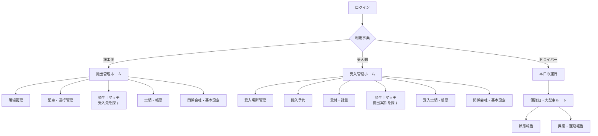
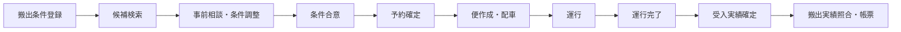
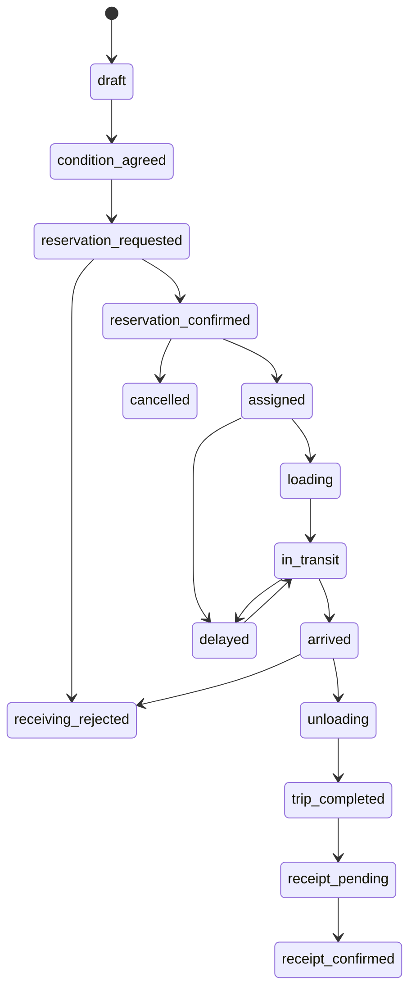
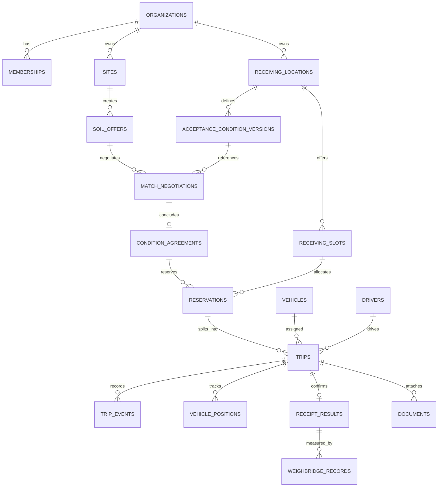

# ECO DUMP 3役割対応 構築設計書

更新日: 2026-09-25  
対象: 施工側管理画面、受入側管理画面、ドライバー用Mobile App  
前提: 現在のECO DUMPロゴ、深緑・白・ライムの配色、表、地図、操作体系を継承する。

## 1. 現状と今回の境界

| 区分 | 内容 |
|---|---|
| 既存実装 | ログイン試作、現場一覧・詳細、搬出・受入スケジュール、運行管制地図、車両・運転手、会社・ユーザー・関係会社、発生土マッチ、入退場、レスポンシブ、ライト／ダークテーマ |
| API・DB接続済みのコード | Supabase Auth、現場一覧取得、当日運行取得、車両・運転手取得、運行予定登録・更新、経路保存、車両位置Realtime購読 |
| 実運用未接続 | Supabase実プロジェクト、実Authユーザー、RLS実データ試験、Storage、Edge Functions、正式地図・大型車経路、通知、計量器、外部マッチング連携 |
| 今回の画面実装 | 施工側メニュー、施工ホーム、現場への導線、配車・運行管理、施工側マッチ初期表示、実績・帳票、事業モード切替 |
| 今回は設計のみ | 受入側の完全分離、ドライバーMobile App、下記の追加DB/API |

画面上の匿名デモ操作はセッション内の試作に限定し、API未接続時は「保存されません」と表示する。実DBの成功応答がない操作を「保存成功」とは表示しない。

## 2. 画面構成図

### 2.1 施工側メニュー

1. 搬出管理〈ホーム〉 — 最初に開く画面。既存スケジュールを現場別で表示
2. 現場管理 — 搬出現場一覧・現場詳細
3. 配車・運行管理 — 未割当／割当済み、運行地図、便詳細
4. 発生土マッチ — 受入先を探す
5. 実績・帳票 — 便実績、搬出量、計量票、CSV／帳票
6. 関係会社・基本設定 — 会社、ユーザー、車両・運転手、協力会社

### 2.2 受入側メニュー

1. 受入管理〈ホーム〉 — 最初に開く画面。既存スケジュールを受入場所別で表示
2. 受入場所管理 — 場所、品目、土質、容量、時間帯、車両条件
3. 搬入予約 — 予約枠、承認、変更、取消、受入不可
4. 受付・計量 — 到着、受付、計量、荷下ろし、退場
5. 発生土マッチ — 搬出案件を探す
6. 受入実績・帳票 — 受入量、計量票、管理票、請求連携用出力
7. 関係会社・基本設定

### 2.3 ドライバーMobile Appメニュー

発生土マッチは配置しない。

1. 本日の運行 — 最初に開く画面。便単位の時系列
2. 便詳細 — 搬出元、受入先、連絡先、注意事項、割当車両
3. 大型車ナビ — 承認済み候補経路、通行注意、経路逸脱警告
4. 状態報告 — 出発、到着、積込完了、受入到着、荷下ろし完了、運行完了
5. 異常報告 — 遅延、渋滞、事故、受入不可、車両故障
6. 履歴・設定 — 過去便、通知、位置情報・音声案内設定

## 3. 画面仕様一覧

| 役割 | 画面 | 目的 | 主な表示項目 | 主な操作・遷移 | 分類 |
|---|---|---|---|---|---|
| 施工 | 搬出管理ホーム | 本日の搬出全体を把握 | 日付、現場、受入先、運行状態、予定便、完了便、未手配、遅延、実車両数、延べ便数 | 絞込、現場詳細、予定詳細、運行詳細、予定追加 | 既存を修正 |
| 施工 | 現場一覧 | 搬出現場を探す | 元請、支店、現場、住所、工期、状態、サービス | 検索、現場詳細 | 既存を活用 |
| 施工 | 現場詳細 | 現場単位の情報集約 | 基本情報、搬出条件、搬出予定、運行状況、実績、書類 | 予定・運行詳細、書類確認 | 既存を修正 |
| 施工 | 配車・運行管理 | 便に車両・運転手を割当 | 未割当、割当済み、重複警告、地図、ETA、状態 | 仮割当、割当解除、便詳細 | 新規作成＋既存地図活用 |
| 施工 | 発生土マッチ | 条件に合う受入先を探す | 土質、数量、期間、距離、必要書類、適合度 | 条件相談、条件合意、予約へ | 既存を修正 |
| 施工 | 実績・帳票 | 搬出実績を確定・出力 | 便、車両、運転手、予定量、実績量、計量票、確定状態 | 差異確認、CSV、帳票 | 新規作成 |
| 受入 | 受入管理ホーム | 本日の受入を把握 | 受入場所、予約枠、到着、待機、受入不可、受入量 | 絞込、予約詳細、受付 | 既存を修正 |
| 受入 | 受入場所詳細 | 条件・容量を管理 | 土質、粒径、試験、日量、時間、車両条件、休業日 | 条件変更、枠設定 | 新規作成 |
| 受入 | 搬入予約 | 搬入枠を管理 | 予約番号、搬出元、便数、車両、時間帯、状態 | 承認、変更、取消、受入不可 | 新規作成 |
| 受入 | 受付・計量 | 実到着を処理 | 到着、予約照合、車番、総重量、空車重量、正味重量 | 受付、計量、荷下ろし、退場 | 既存を修正 |
| 受入 | 発生土マッチ | 搬出案件を探す | 搬出条件、土質、数量、期間、距離 | 条件相談、条件合意 | 既存を修正 |
| Driver | 本日の運行 | 割当便を順に実行 | 便番号、往復番号、時刻、場所、状態 | 便開始、詳細 | 新規作成 |
| Driver | 便詳細 | 安全な運行情報を確認 | 承認経路、注意箇所、連絡先、積載条件 | ナビ開始、状態報告 | 新規作成 |
| Driver | 異常報告 | 管制へ即時連絡 | 種別、位置、写真、コメント、見込遅延 | 送信、電話 | 新規作成 |

## 4. 権限表

`○` 更新可、`△` 参照または申請、`—` 不可。

| 対象 | 管制管理者 | 施工管理者 | 施工配車担当 | 受入管理者 | 受付担当 | ドライバー | 閲覧者 |
|---|---:|---:|---:|---:|---:|---:|---:|
| 会社・契約 | ○ | △ | — | △ | — | — | △ |
| ユーザー・役割 | ○ | ○（自社） | — | ○（自社） | — | — | — |
| 搬出現場 | ○ | ○ | △ | △ | △ | △（割当便のみ） | △ |
| 受入場所・条件 | ○ | △ | △ | ○ | △ | △（割当便のみ） | △ |
| マッチ案件 | ○ | ○ | △ | ○ | △ | — | △ |
| 条件合意 | ○ | ○ | △ | ○ | — | — | △ |
| 予約 | ○ | ○ | ○ | ○ | ○ | △（割当便のみ） | △ |
| 配車 | ○ | △ | ○ | △ | — | △（自分の割当） | △ |
| 運行状態 | ○ | △ | ○ | △ | ○（受付系） | ○（自分の便） | △ |
| 実績確定 | ○ | ○（搬出） | △ | ○（受入） | △ | △（報告のみ） | △ |

権限判定は会社→所属→役割に加え、`site_members`、受入場所担当、運行割当のスコープで行う。両方の事業を行う会社は1つの組織に `business_capabilities = [construction, receiving]` を持たせ、ヘッダーで事業モードを切り替える。切替は表示スコープであり、データ所有組織は変えない。

## 5. 業務フロー

### 5.1 マッチング経由

### 5.2 既存取引先への直接予約

施工側が取引先台帳の受入場所と有効な受入条件を選択→空き枠照会→予約申請→受入側承認→予約確定→便作成・配車。`match_id` は空、`direct_partner_id` と採用した条件版を保持する。マッチングを経由しなくても監査・状態管理は同一にする。

## 6. 状態定義

4つの重要状態は別エンティティ／別日時として管理し、同じ「完了」にまとめない。

| 状態 | 意味 | 確定者 | 取消・変更 |
|---|---|---|---|
| 条件合意 | 土質、数量、期間、価格・費用、書類条件に双方が合意 | 施工・受入双方 | 新版を作り再合意。過去版を保持 |
| 予約確定 | 特定日・時間帯・便数の受入枠を確保 | 受入権限者 | 変更申請→再承認。取消理由必須 |
| 運行完了 | 1便が搬出から荷下ろし・退場まで終了 | ドライバー報告＋管制確認 | 修正は監査ログ付き訂正 |
| 受入実績確定 | 計量・品目・受入可否が受入側で確定 | 受入権限者 | 訂正伝票として差分履歴 |

運行は `trip` 1レコード＝1便。往復は `rotation_no` で区別し、同じ車両・同じ日でも別IDにする。

変更は元レコードを上書きせず、予約版・条件版・イベント履歴を残す。受入不可時は理由、判定者、時刻、写真・計量情報、戻り先／代替先を記録し、施工・配車・ドライバーへ通知する。遅延は予定ETAとの差、原因、更新ETAを持つ。

## 7. データ構成図

### 必要な追加データ

- `organization_capabilities`, `receiving_locations`, `receiving_location_members`
- `soil_offers`, `acceptance_condition_versions`, `soil_tests`
- `match_negotiations`, `condition_agreements`, `agreement_versions`
- `receiving_slots`, `reservations`, `reservation_versions`
- `trips`（または既存 `transport_orders` を便単位へ明確化）、`dispatch_assignments`, `trip_events`
- `receipt_results`, `weighbridge_records`, `documents`, `notifications`, `audit_logs`

既存 `transport_orders` は便管理の核として活用できるが、`reservation_id`, `rotation_no`, `sequence_no`, `cancellation_reason`, `delay_minutes`, `result_status` の追加が必要。

## 8. API一覧

| API | 用途 | 現状 |
|---|---|---|
| Auth/session | ログイン・所属取得 | クライアント実装済み、実環境未接続 |
| GET sites | 現場一覧 | 実装済み、実環境未検証 |
| GET vehicles/drivers | 配車候補 | リポジトリ実装済み、画面は主にデモ |
| GET/POST/PATCH transport-orders | 便一覧・作成・更新 | リポジトリ実装済み、実画面接続は限定的 |
| GET/POST route-plans | 大型車経路 | 保存関数あり、正式経路API未選定 |
| Realtime vehicle-positions | 車両位置 | 購読実装あり、実GPS未接続 |
| GET/POST soil-offers/demands | 搬出・受入案件 | 新規 |
| POST condition-agreements | 条件合意 | 新規、双方承認必須 |
| GET/POST/PATCH reservations | 予約・変更・取消 | 新規 |
| POST trip-events | ドライバー状態報告 | 新規、冪等キー必須 |
| POST receipt-results | 受入実績確定 | 新規、権限・監査必須 |
| POST incidents | 遅延・受入不可・事故 | 新規 |
| GET reports / documents | 帳票・証憑 | 新規、Storage連携 |

## 9. 未確定事項と推奨案

| 未確定事項 | 推奨案 | 理由 |
|---|---|---|
| 施工・受入を別会社レコードにするか | 1組織＋複数capability | 両事業会社の二重マスタを避ける |
| 予約確定権限 | 受入管理者のみ、施工は申請 | 実際の受入容量を受入側が管理するため |
| 運行完了の確定方法 | ドライバー報告＋ジオフェンス＋受入退場の突合 | 誤操作だけで完了させないため |
| 計量差異の許容値 | 受入場所別設定 | 品目・設備で基準が異なるため |
| 大型車経路API | 商用API比較後に決定、道路管理者情報を優先 | 法令・規制の完全性を地図だけで保証できないため |
| オフライン対応 | Mobile Appに送信キューと再同期 | 現場・山間部の通信断に備えるため |
| マッチ名称・外部連携 | 権利・契約確認まではECO DUMP内候補検索として扱う | 外部データ利用許諾が未確定のため |

## 10. 段階別実装計画と完了条件

### Phase 1: 役割別プロトタイプ

- 3役割の画面構造、切替、匿名サンプル、主要導線
- 施工側の今回対象画面をPC・タブレットで操作可能にする
- 完了条件: 全メニュー遷移、主要フィルター、便詳細、仮配車、試作表示、ライト／ダーク、横溢れなし

### Phase 2: データモデル・認証・権限

- 追加テーブル、状態履歴、RLS、capability、役割別ホーム
- 完了条件: 会社越境不可、4つの状態が別管理、1便・複数往復を識別、監査ログあり

### Phase 3: 施工／受入業務API

- 条件合意、予約、配車、実績、変更・取消・受入不可
- 完了条件: API成功時のみ成功表示、競合更新検知、通知・履歴、E2Eテスト

### Phase 4: Driver Mobile App・リアルタイム

- 割当便、位置、状態、遅延、オフラインキュー、車載表示連携
- 完了条件: 実機試験、通信断復旧、位置同意、バッテリー評価、誤送信防止

### Phase 5: 正式地図・帳票・外部連携

- 大型車経路、計量器、Storage、帳票、外部サービス
- 完了条件: 契約・利用許諾、法務・セキュリティ審査、監視・バックアップ、運用手順
