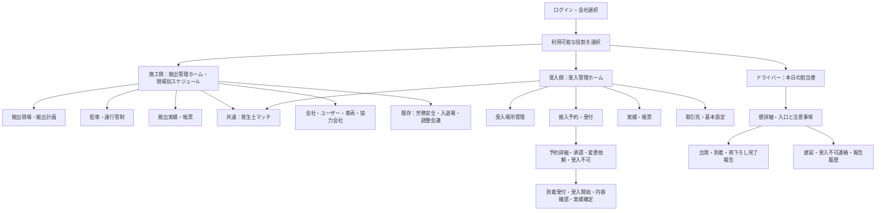
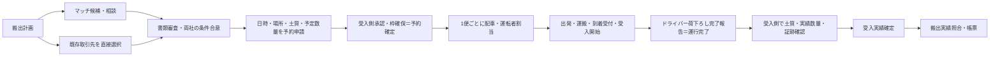
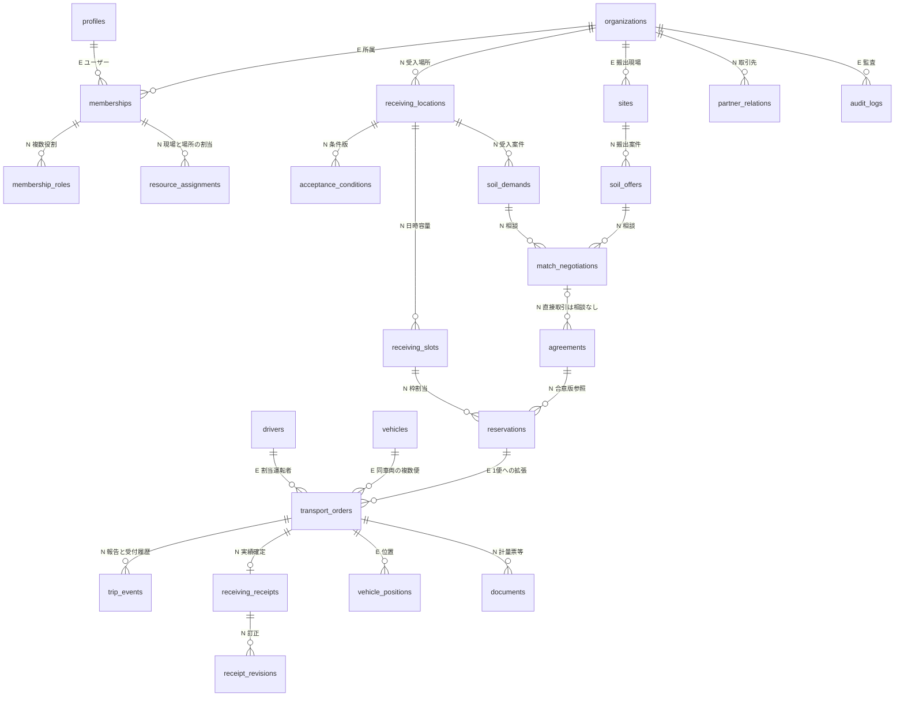

# ECO DUMP 3役割 構築設計書

作成日：2026-09-25 / v1.1 / 対象：施工側・受入側・ドライバー

## 1. この資料の読み方と範囲

- **確定要件**：今回のユーザー指定。施工側と受入側は共通の発生土マッチを使う。ドライバーには配置しない。1便に一意なIDを付け、同じ車両の往復を別便として扱う。条件合意、予約確定、運行完了、受入実績確定を分離する。
- **既存実装**：以下のソースを読み確認した内容。既存資料の「完了」「本番」の表現だけを根拠に実連携済みとは判断しない。
- **今回の変更**：設計を先行して作成し、その後、依頼末尾の受入側6メニューのローカル試作を実装する。施工側は既存機能を保持し役割切替の入口を整える。ドライバーの新規UI・実API・DB移行・公開は対象外。
- **新しい提案**：本書の新API、詳細権限、容量ロック、確定後訂正など。本番仕様としては承認待ち。
- **未確定**：末尾に推奨案・理由・確認先を示す。画面で試せることと業務上確定したことを同一視しない。

## 2. 調査記録・既存資産

対象：`app/AGENTS.md`、`app/src/App.jsx`、`app/src/styles.css`、`app/src/release.css`、`app/src/lib/{databaseConfig,supabase}.js`、`app/src/data/ecodumpRepository.js`、`app/supabase/{schema.sql,README.md}`、`app/IMPLEMENTATION_STATUS_2026-09-10.md`、`app/BACKEND_ARCHITECTURE.md`。

着手時、追跡ファイルの未コミット変更は `app/AGENTS.md` と `app/src/App.jsx`。この会話で行った受入メイン化の変更であり、その意図を役割別に発展させる。多数の ` 2` 付き未追跡資料・画像・ソースは他の作業の可能性があり、削除・上書き・一括ステージしない。Gitへのコミット・push・公開はしない。

|機能・資産|実装の現状|今回の扱い|
|---|---|---|
|ログイン|環境変数設定時Supabase Auth。未設定時は匿名デモセッション|既存を活用。本番認可とは区別|
|現場一覧|`listSites()` が画面から呼ばれる。クラウド成功時DB読込、エラー時はデモ表示を明記|既存を活用|
|現場詳細・地図|Leafletの運行地図、現場表、詳細と既存操作。GPS実連携ではない|既存を活用。削除しない|
|搬出・受入スケジュール|固定配列、当日／翌日、現場別／受入場所別。受入工程なし|既存を修正。集計・切替・カード構造を共用して受入工程を追加|
|運行管制・配車|React stateで予定を追加。DB登録関数は画面未接続|既存を修正する計画。今回施工側機能の再実装はしない|
|発生土マッチ|候補検索・詳細・相談のUI。従来モード切替でも同じ受入候補を表示。相談・登録の文言が保存済みに見える|既存を修正。共通画面で搬出／受入案件を分け、未送信表示にする|
|会社・車両・ユーザー・協力会社|匿名配列、モーダル、局所state。実DB保存のUI接続なし|既存を活用／本番化時修正。受入側の基本設定に既存管理画面への入口を設ける|
|受入場所・予約・受付・受入実績|専用画面・永続データなし|新規作成（今回ローカル試作）|
|ドライバーMobile App|専用画面なし。既存のレスポンシブ管制画面とは別物|新規作成（設計のみ）|
|SQL|11テーブル、組織所属RLS。受入枠・予約・条件合意・受入実績の専用表なし|既存を修正＋新規作成（設計のみ）|

### API／DB連携の実態

`createTransportOrder`、`updateTransportOrder`、`saveRoutePlan` はSupabaseへのinsert/update/upsertコードを持つ。しかし `App.jsx` が利用するリポジトリ関数は現場一覧の `listSites` のみ。車両・運転手・当日運行の取得と位置購読もコードはあるが画面未接続。**実際にDBへ保存できる業務画面は今回の調査では確認できない。** APIコードの存在は実DBでの保存・再取得確認とは異なる。認証セッション・テーマなどのブラウザ保存は業務データ保存ではない。

ローカルには `.env.example` とその複製のみが見つかり、現在の画面もデモ表示。実プロジェクトへのSQL適用、実ユーザー・DB保存・RLS動作は未検証。接続情報・秘密値は資料に転記しない。

現SQLのRLSは所属会社を確認するが、役割別操作・現場／受入場所のスコープを検査しない。`memberships` は会社×ユーザーで1行・単一roleであり、兼業・複数権限に不足。関連先の会社整合性も業務APIで検証する必要がある。監査ログ表はあるが自動記録トリガー／業務APIは未実装。既存資料のMapLibreは計画、現在のコードはLeafletである。

### 並行作業を確認した後の補足

本調査中に、別タスクが `app/src/App.jsx` の施工側メニュー・配車・実績画面、`app/src/release.css`、`app/tests/ui/app-shell.spec.mjs`、`app/docs/ROLE_BASED_PRODUCT_DESIGN.md` を更新し、別タスクが `app/src/driver/` と `app/src/main.jsx` にドライバー入口を追加した。上記の「なし」は着手時点のスナップショットであり、並行作業の完了判定ではない。今回それらを上書き・削除していない。受入側は独立モジュールで追加し、Appの接続点だけを調整した。

施工側の初期画面は並行実装に合わせ **搬出管理ホーム（現場別スケジュール）** とする。下図・C00をこの入口に合わせ、現場一覧C01への遷移を残す。受入側はユーザー指定の **6メニュー** を採用し、並行設計書の7メニュー案とは「搬入予約・受付」にまとめる点が異なる。統合時は本ユーザー指定を優先する。ドライバーの独立試作と今回の受入データは同期していない。

実装時の参照資料は本書と `app/docs/ROLE_BASED_PRODUCT_DESIGN.md`。API関数があることと画面から実DBへ保存して再取得できることは、両資料で区別して扱う。

## 3. 画面構成図と入口

ドライバーとマッチ画面間の導線は設けない。ドライバーからの詳細URL直打ちも本番では拒否する。端末幅を理由に役割を変えない。

## 4. 画面仕様一覧

|ID / メニュー|目的・表示項目|操作と遷移|分類 / 実装段階|
|---|---|---|---|
|C00 搬出管理ホーム〈初期〉|現場別の搬出予定・状態・便数|現場詳細C02、配車C03、実績C04|既存を修正／施工側の並行実装を活用|
|C01 搬出現場一覧|現場名、会社、所在地、期間、稼働状態|検索、詳細C02、地図、既存現場サービス|既存を活用|
|C02 搬出現場・計画|搬出期間、土質、試験書類、総量・日量・単位、搬出元担当|計画編集、マッチM01、既存先へ直接予約R03|既存を修正／後工程|
|C03 配車・運行管制|便ID、予約ID、往復順、車両・運転者、出発／ETA、状態、地図|確定予約から配車、変更、遅延確認、C04|既存を修正／後工程|
|C04 搬出実績・帳票|便ごとの搬出量、受入実績、数量差、証跡|差異照会、CSV、訂正申請|新規作成／後工程|
|C05 基本台帳・既存サービス|会社、ユーザー、車両・運転者、取引先、労務安全、入退場、調整会議|既存遷移を保持|既存を活用|
|R01 受入管理〈ホーム・初期〉|当日／翌日、受入場所別が初期、現場別、予定便数、到着予定、待機、受入中、完了、混雑。1便を1台として集計|検索・場所／混雑絞込、便詳細R03、場所R02、予約一覧。状態変更を即時に集計へ反映|既存を修正／今回|
|R02 受入場所管理|場所名、所在地、入口、営業時間、担当者、土質、容量m³、枠ごとの台数、休業日、注意事項、公開範囲|場所選択、新規・編集、公開／取引先表示の確認。試作では画面内のみ|新規作成／今回|
|R03 搬入予約・受付|予約ID、便ID、同一車両の第n便、現場・取引先、受入場所、日時・枠、予定数量と単位、合意版、予約／運行／受付／実績の各状態|申請承認、理由付き変更依頼・受入不可・取消。到着受付→受入開始→内容確認→実績確定。変更は再承認|新規作成／今回|
|R04 実績・帳票|確定前／確定済、便ID、現場、場所、日付、予定／実績数量と単位、差異、確定者・日時|絞込、R03詳細、匿名デモCSV。正式帳票・電子署名は後工程|新規作成／今回|
|R05 取引先・基本設定|既存先、会社・ユーザー・車両への入口、通知・権限の現状|既存先へ直接予約、既存台帳へ遷移。権限付与は未実装と明記|既存を活用＋新規作成／今回|
|M01 発生土マッチ（共通）|施工側初期＝受入案件を探す、受入側初期＝搬出案件を探す。案件名・地域・土質・数量・期間・参考距離・条件|モード切替、検索・並替、詳細、相談（試作・未送信）、受入側は候補から予約下書き。合意前予約確定は禁止|既存を修正／今回|
|M02 条件調整・書類審査|両社、現場、場所、土質・数量・期間・価格・必要書類、条件版|相互承認、合意の失効／再合意、予約へ|新規作成／後工程。今回合意確認はサンプル入力のみ|
|D01 本日の割当便〈初期〉|自分の便・順序、車両、搬出元／受入先、出発／到着、指示|便詳細、未送信／結果不明件数|新規作成／設計のみ|
|D02 便詳細・状態報告|入口地図、連絡先（業務上必要なもの）、荷種、予定数量、受付番号、承認済経路|出発・到着・荷下ろし完了を報告。完了報告で受入実績確定はしない|新規作成／設計のみ|
|D03 例外・報告履歴|遅延理由、新ETA、受入不可、送信結果・証跡|担当者へ連絡、未送信再送、結果不明の照会|新規作成／設計のみ|

## 5. 権限と兼業会社

本番推奨：会社の有効なmembership × ロール付与 × 操作権限 × 対象現場／受入場所の割当 × レコード状態の積で許可する。画面非表示やURLの `role` は認可ではない。今回の切替は匿名試作の表示切替であり、実ユーザーの権限を変更しない。

|操作|会社管理者|施工管理者|配車担当|受入管理者|受付担当|実績承認者|ドライバー|閲覧者|
|---|---|---|---|---|---|---|---|---|
|所属ユーザー・役割付与|自社のみ|不可|不可|不可|不可|不可|不可|不可|
|搬出現場・計画編集|割当範囲|割当現場|閲覧|取引範囲閲覧|便の必要情報のみ|取引範囲閲覧|割当便の必要情報のみ|割当範囲閲覧|
|受入場所・公開条件編集|割当範囲|公開情報閲覧|取引範囲閲覧|割当場所|閲覧|閲覧|割当便の入口のみ|割当範囲閲覧|
|条件合意|別途業務権限必要|自社側承認|閲覧|自社側承認|不可|閲覧|不可|閲覧|
|予約申請・変更・取消申請|別途業務権限必要|割当現場|割当現場|自社で代行入力可・申請者を記録|不可|不可|不可|不可|
|予約承認・受入不可|別途業務権限必要|不可|不可|割当場所|権限追加時のみ|不可|不可|不可|
|配車・運転者割当|別途業務権限必要|割当現場|割当現場|閲覧|必要情報閲覧|閲覧|自分のみ閲覧|割当範囲閲覧|
|到着受付・受入開始・内容入力|別途業務権限必要|不可|不可|割当場所|割当場所|割当場所|自己報告のみ|不可|
|荷下ろし完了報告|不可|不可|不可|代行は例外権限＋理由|同左|不可|割当便のみ|不可|
|受入実績確定・訂正承認|別途業務権限必要|不可|不可|実績承認権限併有時|不可|割当場所|不可|不可|
|実績・帳票閲覧|割当範囲|関与する現場|関与する便|割当場所|当日受付範囲|割当場所|自分の報告履歴|割当範囲|

公開対象は承認済案件と公開可フィールドに限定。取引先には有効な取引関係と対象予約を確認して入口詳細・担当者等を開示。非公開メモ・他社価格・全運転者名簿は返さない。RLSとAPIレスポンスで強制する。

兼業会社は `organization_capabilities` で施工／受入を複数保持し、`membership_roles` と `resource_assignments` でユーザーごとに複数付与。会社／役割セレクターをロゴ付近に置く。切替時は未保存入力を確認し、会社・役割・対象資源を切り替えてサーバーから再取得。検索・下書きを会社×ユーザー×役割で分離し、戻る／再読込でも文脈を維持する。自社内取引でも申請側／承認側の行為者と条件版を記録する。

## 6. 業務フロー・状態遷移

直接予約は `source=direct`、マッチ経由は `source=matching` と `match_id` を保持。既存先だから条件・書類・枠の確認を省略するわけではない。契約済条件を再利用する場合も適用期間・版・対象場所を検証する。

|独立した状態軸|遷移|ガード・決定者|
|---|---|---|
|条件合意|下書き→協議中→書類確認→双方合意→失効／再協議|両社の権限者、内容ハッシュと版。相談開始を合意扱いしない|
|予約|下書き→申請中→確定／変更依頼／受入不可。変更依頼→再申請。確定→変更申請→再承認。または取消|受入場所権限、合意版、土質・容量・営業時間・枠重複を同一トランザクションで確認|
|運行（便）|未配車→配車済→出発→運搬中→到着→荷下ろし→完了報告。例外：中止|割当運転者の報告・時刻と端末イベントID。運行完了後も実績は未確定でよい|
|受付|未到着→待機→受入中→内容確認待ち→受入完了。例外：受入不可・保留|受付担当、現地土質確認。受付拒否でも履歴と到着事実は保持|
|受入実績|未入力→下書き→確認済→確定→訂正申請→訂正版確定|承認者、実績数量>0、単位、土質、完了報告、数量差の理由。確定記録は上書きしない|
|遅延|遅延なし／遅延連絡中／調整済|工程状態を置き換えないフラグ＋新ETA＋理由。場所枠の自動移動はしない|

**便の識別**：予約1件に便1..N、便に `trip_id` と予約内 `sequence_no`。車両番号をキーにしない。例：同じ車両01の `T-001（1便）` と `T-002（2便）` は別の予定・運転者報告・計量・実績を持つ。予約数量の配分合計を検証し、車両や運転者の時間重複も検査する。

### 変更・例外の扱い（本番推奨）

|事象|扱い|画面表示・必要情報|
|---|---|---|
|合意前・予約確定前の修正|版を更新。相手へ再確認|旧／新差分、変更者、理由、再申請|
|確定後の数量・土質・日時変更|旧枠を維持した変更申請。新枠確保と旧枠解放を原子的に行う。承認前は旧予約が有効|有効予約と変更案を並べる。試作では確定前の変更依頼のみ|
|取消|未到着は理由付き取消、枠解放。出発後は中止調整、到着後は現地例外処理|関係者へ通知、既発生の運行・計量記録は保持|
|受入不可|予約審査での否認と現地拒否を区別。現地拒否は理由・写真・指示、搬出側調整へ|代替先を勝手に確定しない。便IDを残して再配車の関連を記録|
|遅延|新ETA、理由、枠の再調整要否を伝える|混雑と遅延を区別。未通知／通知済を表示|
|予定と実績の差|単位が同じ場合のみ差分。正の数量・理由・承認者を要求|m³とtを自動換算しない。密度・測定方法を別途合意|
|通信断・応答不明|未送信、送信中、失敗、結果不明を区別|結果不明を自動再送しない。冪等キーで処理状態を照会|
|同時更新|version不一致は409、差分を読み直す|上書き禁止。再確認して別の意図として送信|
|確定後の誤り|訂正レコードと承認フロー|原票と新旧値・理由・承認を保持|

## 7. データ構成図

凡例：E＝既存表を活用／拡張、N＝新規提案。実DBへの適用は今回行わない。

|データ|必要な主要項目・制約|
|---|---|
|organizations / memberships 拡張|事業区分、複数role、権限有効期間。会社管理と業務承認を分離|
|receiving_locations|所有会社、名称、公開所在地、取引先向け入口・担当者、営業時間、休業日、公開範囲。公開投影ビューで非公開項目を除く|
|acceptance_conditions|場所、版、土質、上限数量＋単位、書類要件、注意事項、有効期間|
|receiving_slots|場所、タイムゾーンAsia/Tokyo、開始／終了、台数上限、数量上限、予約済容量、閉鎖状態、version|
|soil_offers / soil_demands|所有会社、現場／場所、期間、土質・数量単位、公開可否、試験書類|
|agreements|双方会社、搬出現場、受入場所、source、任意match_id、条件スナップショット、双方承認者・日時、期限、版|
|reservations|両社、agreement_id/version、場所・現場・枠、予定量＋単位、予定便数、source、状態、理由、version|
|transport_orders 拡張|予約ID、sequence_no、車両・driver、計画・ETA、運行状態。unique(reservation_id, sequence_no)。既存statusからの移行表が必要|
|trip_events|便ID、event_type、actor/role、発生時刻・受信時刻、数量・位置等の限定payload、client_event_id一意、代行理由|
|receiving_receipts|便ID一意、予定スナップショット、実績量＋単位、実土質、測定方法、差異理由、driver_report_id、確認者／確定者／日時、version|
|documents|会社・予約／便、分類、Storageキー、閲覧権限、hash、版。公開URL直置き禁止|
|idempotency_records / audit_logs|キー、actor、body_hash、処理結果、状態、有効期限。状態変更と同一トランザクションで監査|

## 8. 必要API一覧（提案。現在のREST実装ではない）

全更新に認証・会社／資源権限・入力検証・`Idempotency-Key`・`expectedVersion`。状態はサーバーが決定。成功後は正本を再取得。UTC保存・JST表示、日付検索はJST日のUTC範囲で行う（既存のUTC日付切出しは要修正）。

|API|用途・主な入力／出力|既存との関係|
|---|---|---|
|GET /me/contexts|所属会社・利用役割・現場／場所スコープ|Authを活用、新規|
|GET/PATCH /organizations/:id/members|複数role・スコープ・失効|既存表を修正、新規業務API|
|GET /sites, GET/PATCH /sites/:id|搬出現場|listSites読込を活用、更新新規|
|GET/POST/PATCH /receiving-locations|場所、条件・公開範囲、version|新規|
|GET /receiving-locations/:id/schedule?date=|便ごとの予定・ETA・工程・混雑|新規|
|GET/PUT /receiving-locations/:id/slots|時間枠・台数・数量・閉鎖日|新規|
|GET/POST /soil-offers, /soil-demands|公開投影と自社管理|新規|
|GET /matches, POST /negotiations|条件絞込候補・相談|既存画面を活用、API新規|
|POST /agreements/:id/approve|双方承認、版固定|新規|
|GET/POST /reservations|直接／マッチ予約。合意ID、日時、予定量、便数|新規|
|POST /reservations/:id/{approve,request-change,reject,cancel}|枠と予約の原子的更新、理由|新規|
|GET/POST /trips, POST /trips/:id/assign|1便生成、車両／運転者、時間重複検査|transport_ordersリポジトリを拡張|
|GET /driver/trips|認証運転者の割当のみ|新規|
|POST /trips/:id/events|出発、到着、荷下ろし、遅延報告|新規、event_id冪等|
|POST /trips/:id/reception/{arrive,start,reject}|受付担当の現地工程|新規|
|PUT /trips/:id/receipt-draft|実量・単位・土質・証跡・差異理由|新規|
|POST /receipts/:id/{confirm,request-correction}|承認権限、前提状態、版|新規|
|GET /receipts, POST /reports/export|権限付き実績取得、非同期帳票|新規|
|GET /partners, POST /partners|取引先関連・範囲|新規|
|POST /documents/upload-url|制限付き署名URL、検疫完了後参照|新規|
|GET /operations/:idempotencyKey|不明結果の照会|新規|
|位置購読・承認経路|GPS購読、経路保存・再取得|既存repositoryを活用、実接続未検証|

エラー：401未認証、403権限なし、404スコープ外、409競合／枠超過、422状態／単位／条件不一致、503一時障害。内部DBエラー・秘密情報はUIに出さない。

## 9. 段階別計画と完了条件

|段階|成果|完了条件|
|---|---|---|
|0 現状整理・全体設計（今回）|本書、分類、権限・状態・データ・API|確定要件と推奨案が区別され、3役割と直接予約を網羅|
|1 受入側試作（今回）|6画面、共有マッチ、表示切替、匿名データ、状態連動|PC／タブレットで場所編集→予約審査→受付→受入→内容確認→確定→帳票を確認。未保存・未送信が明示される|
|2 正本DB・認可|移行SQL、複数役割・スコープ・取引境界、監査、冪等API|別会社／現場／場所／運転者の否定テスト、競合枠・重複送信、バックアップ復元。実DB保存後再ログイン／再取得一致|
|3 条件合意・予約・配車|両社承認、枠予約、1便生成、変更申請|合意≠予約、枠超過防止、同車両の複数往復、直接先予約を実APIで通す|
|4 Driver App・受付実連携|割当、報告、受付、オフライン状態|端末実機で通信断・結果不明・重複、他者便拒否。ドライバーが実績を確定できない|
|5 実績・帳票・運用|確定・訂正、数量差、監査・正式帳票|単位混在と差異、承認分離、改ざん防止、通知・障害運用を担当者が受入|
|6 公開判断（今回対象外）|本番環境・契約・監視・権限レビュー|運用責任者の承認、実機・本番相当テスト・復旧演習。pushを公開完了扱いしない|

## 10. 未確定事項と推奨案

|未確定事項|推奨案|理由／確認先|
|---|---|---|
|数量の標準単位|土量m³を初期、重量tは別測定値として扱う|無条件換算を避ける／施工・受入業務責任者|
|容量の基準|時間枠ごとの台数と数量を両方制限|小型／大型混在で台数だけでは不足／受入責任者|
|実績確定権限|受付と承認を分離、小規模会社では明示的兼務を許容|責任追跡と実運用を両立／運用責任者|
|運行完了時点|当該搬入便の荷下ろし完了報告を完了と定義。復路は別便扱いまたは別行程|複数往復と受入確定の混同を防止／運送責任者|
|位置・入口・担当者の公開|市区町村・土質・営業時間は公開候補、詳細入口・担当者は取引先限定|安全と個人情報／会社管理者|
|同社内の双方承認|役割を分離、例外兼任時は理由・監査|自己承認の扱い／内部統制責任者|
|取消期限・費用・締め後訂正|初期は担当者協議、勝手な自動課金なし|契約条件が未定／両社責任者|
|休業日と既存予約|閉鎖前に影響便一覧と変更調整を要求|予約を黙って消さない／受入責任者|
|大型車ルート・GPS|既存地図を活用、正式API・同意・保管期間は別途決定|一般車ルートは大型車通行を保証しない／運行責任者|
|ドライバー配布形態|PWAから検証、Push・バックグラウンドGPS必要性でネイティブ判断|実機検証前に方式を固定しない／開発・運行責任者|

## 11. 次工程への引き継ぎ

今回のローカル動作・未対応の証跡は `RECEIVING_IMPLEMENTATION_HANDOFF.md` に記載する。本書のAPI・データモデルは設計提案であり、現SQLに適用済みではない。UI試作の状態管理をそのまま本番の認可／状態確定処理にしない。サーバーの契約・移行・業務確認を先に実施する。
