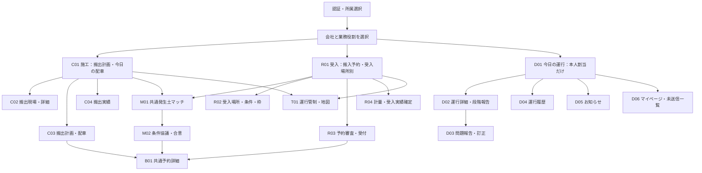
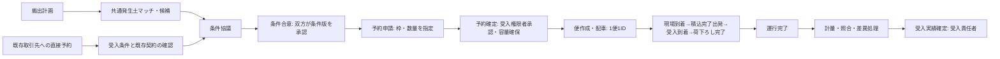
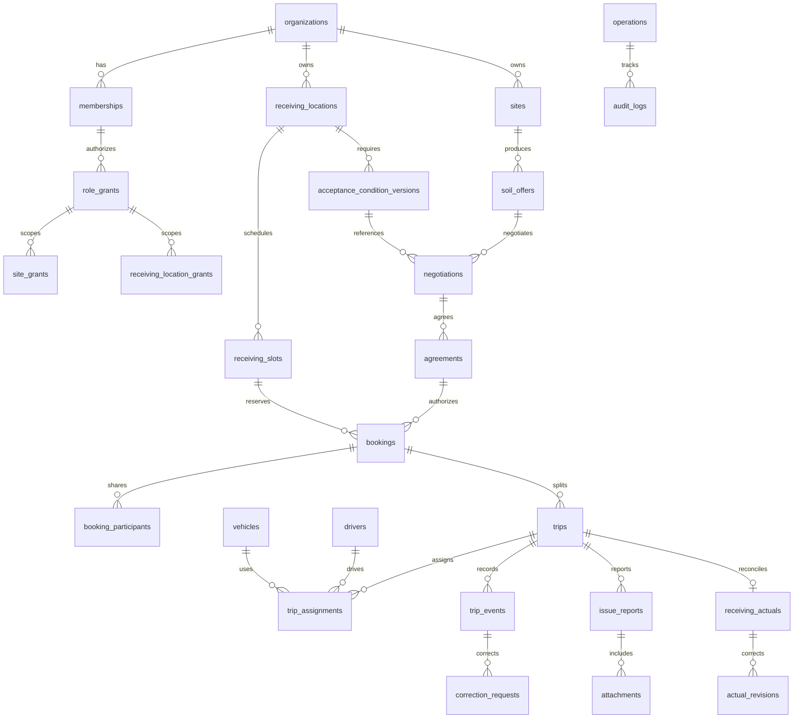

# ECO DUMP 三役割構築設計書

作成: 2026-09-25 / 対象: ECO DUMP new / 状態: 実装調査に基づく設計案（業務責任者の承認前）

## 1. 範囲と判断の区別

**ユーザー確定事項**: 施工・受入・ドライバーの3役割。発生土マッチは施工・受入で共通、ドライバーには配置しない。1便を管理単位とし同一車両の往復を別便にする。条件合意・予約確定・運行完了・受入実績確定を分離する。既存画面・ロゴ・色・表・地図・操作を活用し、他の作業者の変更を保護する。今回は全体設計とドライバー向けモバイルWeb試作まで。公開・本番反映は対象外。

**今回の設計提案**: 以下の画面ID、API、テーブル追加、権限粒度、状態名、承認・訂正手順。既存機能として扱わない。

**今回の実装**: 独立入口 `/?app=driver&device=iphone` のドライバー試作。匿名の本人割当便、端末内の報告下書き・写真保持・訂正、4タブ。通信状態の確認は明示した模擬表示。API送信、実認証、GPS、Pushは未接続。

**既存調査の根拠**: `app/AGENTS.md`、`src/App.jsx`、`src/main.jsx`、`src/styles.css`、`src/release.css`、`src/data/ecodumpRepository.js`、`src/lib/{databaseConfig,supabase}.js`、`supabase/schema.sql`、`supabase/README.md`、`BACKEND_ARCHITECTURE.md`、`IMPLEMENTATION_STATUS_2026-09-10.md`、`tests/db-schema.test.mjs`、`tests/ui/app-shell.spec.mjs`。過去資料の「完了」は今回の実DB確認の証明にはしない。

着手時、`app/AGENTS.md` と `app/src/App.jsx` に受入メイン化の未コミット変更あり。初期画面・ロゴ遷移が搬出・受入スケジュール、初期タブが受入場所別。労務安全・調整会議のメニュー除外も先行変更。これらは変更しない。名前末尾「 2」の未追跡複製ファイル群も編集・削除しない。

## 2. 現状と再利用判断

|機能|現状の根拠・保存範囲|分類|今回／将来の扱い|
|---|---|---|---|
|ロゴ、深緑／ライム、明暗テーマ、表、検索、モーダル|既存App・CSS・publicのロゴ|既存を活用|ドライバーでも同じブランド、44px以上の操作領域|
|現場一覧・詳細|FieldList / FieldDetailPage。クラウド設定＋認証時だけlistSites。通常は匿名デモ|既存を修正|施工現場と受入場所を分離し担当範囲を適用|
|搬出・受入スケジュール|TransportSchedulePage、固定transportPlans。現場別・受入場所別等の切替|既存を修正|施工初期は現場別、受入初期は受入場所別。予約APIへ接続|
|発生土マッチ|MatchingPage、候補検索・並替・相談・案件登録UI。相談はuseState、登録確認もDB呼出なし|既存を修正|共通業務データと両側の権限を追加、合意と予約を分離|
|配車・運行管制|ControlTowerPage、tripsはuseState、配車モーダルあり|既存を修正|予約から1便を生成、割当・再配車・実績へ接続|
|地図|OperationsMapはLeaflet＋OSMタイル。固定位置や経路候補、位置取得UIを含む|既存を活用|地図の操作方式・色を再利用。商用大型車経路・GPS連携の証拠ではない|
|会社・ユーザー・車両・協力会社|CompanyPage等、主に固定値と画面内操作|既存を修正|権限・台帳API・変更監査が必要|
|入退場|GatekeeperPage、独立サービスのデモUI|既存を修正|受入の受付イベントと連携し重複記録を防止|
|労務安全・調整会議|コンポーネントと直接ルートは残存、メニューから除外は先行変更|既存を活用|今回触らない。廃止決定と解釈しない|
|認証／現場一覧読込|Supabase signInWithPassword / listSites が画面から呼ばれる|既存を修正|接続コードあり。実接続・本番運用は未確認|
|車両・ドライバー取得／運行作成更新／経路保存／位置購読|repositoryに関数あり。App側の呼出はlistSitesのみ確認|既存を修正|未接続の部品。画面から保存可能とは扱わない|
|ドライバー4タブ・本人便・段階報告・問題報告・訂正|既存専用画面なし|新規作成|今回モバイルWeb試作、後続で認証・送信を接続|
|受入条件・予約枠・予約承認・計量・実績確定|将来構想の資料あり、中核テーブル・APIは未実装|新規作成|施工／受入の後続実装|
|端末送信キュー・結果照会・監査付き訂正|既存なし|新規作成|今回端末下書きまで。サーバ冪等処理は後続|

### API・DBの実装到達点

SQLには organizations / profiles / memberships / projects / sites / vehicles / drivers / route_plans / transport_orders / vehicle_positions / audit_logs の11表がある。全表RLSの有効化定義あり。ただし多くのCRUDは `has_org_access(organization_id)` のみ。**会社所属だけで会社内の各行を更新できる設計であり、driver本人・担当現場・受入場所の制限がない**。driverロールが列挙されていることは権限完成の証拠ではない。

`memberships` の一社一ユーザー一行・単一roleでは複数権限を表しにくい。関連外部キーの会社整合、共同予約への当事者限定共有、状態遷移のトランザクション、監査ログ自動追加、version/idempotencyも追加が必要。`transport_orders` はm³のみで便・予約・受入実績が混在し、4つの業務状態を表せない。

今回ローカルapp直下の実 `.env` ファイルは確認されず、通常起動はdemo。外部DBへの接続・SQL適用・実保存検証はしていない。環境変数が存在するだけでも保存検証完了とはしない。`db-schema`テストはSQL文字列の静的検査で、実ユーザー間RLSの実行試験ではない。既存UIには未保存でも「登録しました」「相談案件を作成しました」と表示する箇所がある。既存画面は今回修正しないが、後続接続前の是正対象とする。

## 3. 画面構成図・入口

施工メニュー: 搬出計画・配車／搬出現場／発生土マッチ／運行管制／搬出実績／会社・ユーザー・車両／関係会社。受入メニュー: 搬入予約／受入場所・条件／発生土マッチ／受付／受入実績／運行管制／基本台帳。既存付帯機能の表示可否は権限整理後に決定し、無断削除しない。

ドライバー下部メニューは「今日の運行」「運行履歴」「お知らせ」「マイページ」のみ。初期はD01、他ドライバー一覧とマッチへのリンクは持たない。非表示に加えサーバ側も拒否する（今回は試作なので認証境界未実装）。

両事業会社はヘッダーに施工／受入スイッチ。会社能力 `organization_capabilities` と本人の有効なrole_grantの積で表示。切替で会社そのものは変えず、selectedSite・フィルター・キャッシュキーを `companyId + role + scope` で分離。未保存編集中は保存または破棄を明示してから切替。URLのrole指定だけで権限は付与しない。ブラウザ戻る・復元時もサーバで再認可。既存の「操作ユーザー切替」は認証代理として流用しない。

## 4. 画面仕様一覧

分類: 活用=既存を活用、修正=既存を修正、新規=新規作成。各画面は読込中／0件／取得失敗／権限なしを区別。更新結果不明を成功表示しない。

|ID・画面・分類|目的・表示項目|操作と遷移|
|---|---|---|
|C01 搬出計画・今日の配車（修正）|日付、現場、予約枠、予定数量、配車数、遅延・未配車|日付・現場で検索、C03/B01/T01へ|
|C02 搬出現場一覧・詳細（修正）|現場名・住所・入口・担当・工期・土質・書類・担当者|登録編集（担当範囲）、C03/M01へ|
|C03 搬出計画・配車（修正）|計画ID、予約ID、日付、便順、車両、運転手、往復番号、経路、数量単位|直接予約→B01、確定予約から便作成、重複割当検査、再配車、T01へ|
|C04 搬出実績（新規）|便ID、予定/搬出申告数量、受入計量数量、差異、受入確定状態|差異確認・照会・CSV、B01/T01へ。受入確定を代行しない|
|R01 搬入予約一覧（修正）|受入場所別の時間枠・容量・予約会社・車種・土質・審査状態|絞込、R03/B01、場所別を初期表示|
|R02 受入場所・条件・枠（新規）|住所・入口・連絡・土質基準・試験期限・数量単位・容量・時間・車両制限|条件の版管理、休止、枠設定、M01へ。既存予約への影響一覧|
|R03 予約審査・受付（新規、一部既存入退場を修正）|条件版・申請書・時間枠・予定量・車両・便・到着時刻|承認／差戻し／拒否、QR等受付は後続、受入不可登録、R04へ|
|R04 計量・受入実績（新規）|便・重量/容積・単位・計量票・受入量・差異・確定者|下書き、照合、確定、訂正申請。運行完了と独立|
|M01 発生土マッチ（修正、共通）|搬出/受入案件、条件適合、距離、時期、数量、候補|検索・並替・案件編集・相談→M02。適合表示で契約/予約を自動成立させない|
|M02 条件協議・合意（新規）|当事者、土質条件版、期間、数量、単価/費用条件、資料、双方承認履歴|条件提案・差戻し・両者合意→B01。相手社の内部情報は非公開|
|B01 予約詳細（新規）|origin=match/direct、当事者、条件版、枠、数量、状態、関連便|申請・受入承認・変更依頼・取消。承認時容量を排他確保、C03/R03へ|
|T01 運行管制・地図（修正＋地図活用）|便、往復番号、出発・到着、状態、問題、位置情報の取得時刻|絞込・便詳細・配車修正。GPS未取得は位置不明、経路案と承認経路を区別|
|A01 基本台帳・関係会社（修正）|会社、ユーザー、複数権限、現場/受入場所担当、車両・運転手、取引関係|招待・権限付与/失効・編集・監査。管理者のみ|
|D01 今日の運行（新規）|本人便を計画順、次便強調、搬出・受入・指定時刻・車両・状態・往復番号|便選択→D02、未送信件数→D06|
|D02 運行詳細（新規）|両端の住所・入口・担当・連絡先、土質・量・単位、指定経路、注意、状態と次操作|到着→積込出発→受入到着→荷下ろしの大ボタン、確認画面、D03、報告訂正|
|D03 問題報告・訂正（新規）|便、遅延/受入不可/その他、メモ、写真、送信状態、元イベント|下書き保存、将来送信、理由付き訂正依頼。受入不可は運行を保留|
|D04 運行履歴（新規）|日付、便番号・往復番号、荷下ろし状態、受入実績の確定/未確定|検索・詳細D02。荷下ろしで受入確定にしない|
|D05 お知らせ（新規）|自分に関係する配車変更・予約変更・問題対応、時刻・既読|詳細と関連D02へ。Push未接続を明示|
|D06 マイページ（新規）|本人・会社・車両、端末下書き、送信状態、GPS/通知接続状況|下書き確認、明暗切替、将来ログアウト。未送信保持の扱いを説明|

## 5. 権限表（提案・APIとRLSで強制）

○=担当範囲で操作、閲=必要項目の参照、承=確定・承認、—=不可。全て有効所属と有効担当割当が前提。会社管理者でも相手社の承認は不可。

|データ・操作|会社管理者|施工責任者|施工配車担当|受入責任者|受付担当|ドライバー|
|---|---|---|---|---|---|---|
|自社ユーザー・role・担当割当|○|—|—|—|—|本人プロフィール閲|
|施工現場・搬出計画|自社○|担当現場○|担当現場閲・配車○|予約に必要な共有項目閲|当日予約の共有項目閲|本人便のスナップショット閲|
|受入場所・条件・容量|自社○|公開/取引条件閲|予約条件閲|担当場所○|担当場所閲|本人便の入口・注意閲|
|共通マッチ案件・協議|自社○|担当搬出○・自社側合意承|閲|担当受入○・自社側合意承|—|—|
|予約申請・変更依頼|自社側○|担当搬出○|担当搬出○|担当受入○|閲|本人便の予約情報閲|
|受入予約確定・拒否|受入権限もある場合承|—|—|担当場所承|原則—|—|
|配車・再配車・取消依頼|施工権限もある場合○|担当現場○|担当現場○|関連便閲|関連便閲|本人便閲|
|受付・受入不可|受入権限もある場合○|関連便閲|関連便閲|担当場所○|担当場所○|問題として申告のみ|
|運行イベント・写真|権限範囲閲|関連便閲|関連便閲|関連便閲|関連便閲|本人に現時点で割当済みの便に追記|
|計量・受入実績確定|受入権限もある場合承|関連実績閲|関連実績閲|担当場所承|下書き○、確定不可|本人便の必要最小結果閲|
|訂正承認・監査|自社対象閲/承|搬出訂正承|依頼のみ|受入訂正承|依頼のみ|本人報告の訂正依頼のみ|

会社境界: `organization_id` をリクエスト値だけで信頼せず認証所属から判定。予約の施工会社/受入会社/運送会社は `booking_participants` に明記し、共有項目を専用view/APIで返す。担当現場 `site_grants` と受入場所 `receiving_location_grants` を別管理。ドライバーは `auth.uid -> driver.profile_id -> active trip_assignment` で本人便を絞る。割当失効・所属停止後は再取得・書込み拒否。車両や現場FKも許可会社/契約関係と照合し、他社IDの差込みを防ぐ。

## 6. 業務フロー・状態遷移

直接予約は `origin=direct`、match_candidate_id はnull、取引先・契約/条件版を指定。同じ受入条件確認・予約審査・容量確保を通す。既存契約による事前合意の再利用は版と有効期間が一致する時だけ。取引先であることだけでは予約確定しない。

|集約|状態遷移（提案）|確定権者・制約|
|---|---|---|
|条件協議|draft → negotiating → agreed / rejected / withdrawn；agreed → superseded / expired|双方権限者が同一条件版へ承認。変更は新revision|
|予約|draft → requested → confirmed / returned / rejected；confirmed → change_requested / cancellation_requested → confirmed(new revision) / cancelled|受入責任者。変更中は旧確定枠を保持。承認トランザクションで差分容量更新。中止で解放|
|便|planned → assigned → site_arrived → in_transit → receiver_arrived → unloaded(completed)|現割当本人が順番通りイベント報告。planned/assignedのみ通常cancelled。開始後中止はaborted＋責任者処置|
|問題|open → acknowledged → resolving → resolved|遅延は便状態と独立。受入不可ではhold=true、管理者の再指示まで荷下ろし報告不可|
|受入実績|pending → draft → reviewing → confirmed → correction_requested → corrected|受入責任者のみ確定。完了便でも差異未解決ならpending/reviewing|
|配送状態|unsent → sending → sent / failed / unknown；unknown → status lookup → sent / definitively_not_applied|sentはサーバ受領＋refetchでのみ表示。unknownは自動再送しない|

**往復管理**: 同一車両・運転手が3往復する場合、trip_idは3つ（例 TR-001/002/003）、booking_idは共通でもよい。rotation_number=1/2/3、planned_sequence、運行時間帯、独立イベント・実績を保持。車両登録番号や日付だけを一意キーにしない。帰路自体に別荷物がある場合は独立した便を作りlinked_trip_idで関連付ける（推奨・要業務確認）。

### 変更・例外・訂正

- 土質/数量/期間/受入条件変更: 合意版を更新し再合意。確定予約へ自動上書きせず影響する予約・便を列挙、受入側再承認後に通知。運行中は指示待ち。
- 配車変更: 旧割当を終了、新割当を追記。旧本人からの報告は409/403、再取得と担当連絡を案内。過去報告の作成者は維持。
- 取消: 未開始は権限者が理由付き取消、容量解放と本人への通知。運行開始後は通常取消不可、処置・積荷行先を管理者が決めaborted等へ。課金は別途要決定。
- 受入不可: 写真/理由、受付判断、保留。ドライバーだけで代替先決定・予約変更・荷下ろし完了にしない。管理者が返送/代替予約を指示し新便との関係を記録。
- 遅延: 遅延分数（将来API）・理由・見込みを申告、予約枠への影響を受入側が判断。実績時刻を予定時刻に書き換えない。
- 誤操作: 送信前下書きは理由付き取消イベントを追記（試作では最後の未送信段階のみ取り消し、直前へ）。サーバ受領済は元イベントIDと訂正理由で申請、権限者が承認。後続報告/実績確定済なら関連影響を確認、削除・無断巻戻し不可。
- 通信: オフラインは端末内保管。HTTP未送出が確定した失敗のみ明示再送可。タイムアウト等はunknownで保留し同じoperationIdの結果を照会。二重タップは送信中無効。Idempotency-KeyとexpectedVersionで重複・競合を検出。
- 写真: 非公開ストレージ、短期限URL、検証済み画像形式/容量、所属失効時の閲覧停止。位置EXIF・保管期限は未確定。試作ではIndexedDB内に保持し外部送信しない。

## 7. データ構成図

|データ群|必要項目・関係・分類|
|---|---|
|organizations/profiles/memberships|既存修正。会社の業務能力、複数ロール、active、有効期間。会社・ユーザーの既存ID維持|
|role_grants/site_grants/receiving_location_grants|新規。user、org、role、scope、有効期間、付与者|
|sites/receiving_locations/入口連絡先|sites修正＋受入場所新規。住所、入口座標、担当、電話、注意、管理会社。既存sitesを破壊せず移行表で対応|
|soil_offers/acceptance_condition_versions|新規。土質、試験/文書、有効期間、量/単位、車両制限、受入条件版|
|negotiations/agreements|新規。両社、条件スナップショット、revision、双方承認者・時刻・期限|
|receiving_slots/bookings/booking_participants|新規。JST営業日＋UTC時刻、時間枠、容量、予約量/単位、origin、agreement、状態、version、両社・運送会社|
|trips（既存transport_ordersを段階移行）|既存修正。予約ID、便ID、往復番号、sequence、予定/実時刻、搬出/受入ID、cargo、quantity、unit、状態、version|
|trip_assignments|新規。便・車両・driver・開始終了時刻・割当revision。重複時間帯をDBで制約|
|trip_events/operations|新規。eventId、operationId一意、便・actor・type、occurredAt/receivedAt、expectedVersion、結果、端末識別。イベント追記のみ|
|issue_reports/attachments/correction_requests|新規。問題種別、hold、メモ、写真、元event、理由、承認者、解決情報|
|receiving_actuals/actual_revisions|新規。便ID一意の集約、搬出申告量、計量値、単位、票、差異、confirmedBy/At、revision|
|route_plans/vehicle_positions|既存修正。承認版と期限、測位精度・取得時刻・本人割当範囲。自動追跡とは区別|
|notifications/audit_logs|通知新規・監査既存修正。対象user、関連便、既読、送信結果、before/after、actor。状態更新と監査を同一transaction|

m³とtは別単位。換算係数を無断適用しない。予約枠容量は単位別に管理し、単位不一致は審査に戻す。業務日付はAsia/Tokyoで計算、DB時刻はUTC。既存listTodayTransportOrdersのUTC日付・23:59:59.999未満フィルタはJST日区間 `[start, nextDayStart)` へ修正対象。

## 8. API一覧（設計案、未実装）

既存接続はSupabase SDK/PostgREST。下記REST表記は契約を整理するための論理APIで、Edge Function/RPCへの配置は未決定。既存直接更新repositoryは重要状態の更新にそのまま使わず、認可と検証を集約する。

|API|権限・入出力・制約|
|---|---|
|GET /me/context|所属・能力・role・scope。本人のみ、会社/役割切替の根拠|
|GET/POST/PATCH /sites、/receiving-locations|担当スコープ、住所/入口/担当/注意。PATCHはversion|
|GET/POST /receiving-locations/:id/conditions、/slots|受入責任者更新、版・容量・停止期間|
|GET/POST/PATCH /soil-offers、GET /matches|施工/受入限定。条件と公開範囲に基づき検索|
|POST /negotiations、POST /agreements/:id/approvals|当事者の該当権限者。双方同一revisionで合意|
|GET/POST /bookings、POST /bookings/:id/{confirm,change,cancel}|当事者限定。条件版・数量単位・容量を同一transaction検査|
|GET/POST /trips、POST /trips/:id/assignments|配車権限。確定予約のみ、車両/本人の重複割当禁止|
|GET /driver/trips?date=YYYY-MM-DD、GET /driver/trips/:id|サーバで本人割当抽出。ページング、状態・version・必要最小連絡情報|
|POST /driver/trips/:id/events|type、occurredAt、operationId、expectedVersion。段階順・割当・hold検証|
|POST /driver/trips/:id/issues|種類、memo、attachmentIds。受入不可はhold。本人のみ|
|POST /attachments/upload-intents、POST /attachments/:id/finalize|本人便に限定した非公開upload、形式・容量検査。完了してからイベントへ関連|
|GET /operations/:operationId|本人の送信結果照会。applied/not_applied/pendingを明示、unknown再送禁止|
|POST /correction-requests、POST /correction-requests/:id/approve|本人依頼、責任者承認。元event・理由必須、監査を追記|
|POST /trips/:id/gate-events|受付権限。予約と車両照合、重複受付防止|
|GET/PATCH /trips/:id/receiving-actual、POST …/confirm|受入担当下書き、受入責任者確定。単位・計量票・差異を検査|
|GET /driver/notifications、POST /notifications/:id/read|本人宛のみ。Push配送とは別|
|POST /driver/positions、POST /push-subscriptions|将来段階。明示同意・有効割当・保存期限が前提|

全mutation: 認証・対象認可、Idempotency-Key、expectedVersion（作成はclient生成ID）、requestId、監査。応答はid/status/version/serverTime。401=再認証、403=担当失効、409=再取得/競合提示、422=条件不整合、429=待機、5xx/切断=結果照会へ。予約容量と状態更新はDB transaction/row lockで競合試験する。

## 9. 段階別実装計画・完了条件

|段階|実装対象|完了条件|
|---|---|---|
|0 今回：全体設計・ドライバーWeb試作|本書、iPhone枠、4タブ、本人匿名便、段階下書き、問題/写真、訂正、状態表現|ブラウザで390pxの表示と主要操作・リロード復元確認。API未接続を常時明示。既存変更を保持。実機確認は別記|
|1 データ・認証・権限|移行計画、複数role、担当スコープ、共同予約共有、運行event/operation|隔離DBでmigration往復・バックアップ復元、2社/複数現場/2ドライバーの拒否試験、サーバ監査記録。画面非表示だけで合格にしない|
|2 条件合意・予約・直接予約|共通マッチ修正、条件版、枠・容量、予約承認/変更/取消|4状態分離、直接予約も同一審査。並行予約で過剰予約0、相手承認のなりすまし拒否、refetch一致|
|3 配車・ドライバー実送信|本人便API、順次event、写真Storage、idempotency、結果照会、訂正|同一車両3往復独立、二重送信1件、切断後結果照会、旧割当拒否、端末再起動・ログアウトと下書き分離、保存後再取得一致|
|4 受入・実績|受付、受入不可、計量、差異照合、受入責任者確定、訂正監査|荷下ろしだけでは確定不可、権限別実行試験、単位差異解消、訂正前後の証跡|
|5 実機・運用（今回対象外）|iPhone Safari/PWA、Android、カメラ、GPS、Push、監視/復旧|実端末で権限拒否・オフライン・復帰・写真容量・バックグラウンド制限を確認。位置/Pushは実受信で判定。公開承認は別途|

## 10. 未確定事項・推奨案・理由

|未確定事項|推奨案|理由・決定者|
|---|---|---|
|最終合意/予約/実績確定の責任者|合意は両社、予約/実績確定は受入責任者|責任を分離。両業務責任者が決定|
|土量単位・計量基準|m³とtを保持、換算は承認係数版を別管理|過大/過小集計防止。受入運用が決定|
|予約粒度|時間枠＋数量、確定後に複数便へ分割|複数往復と容量両立。配車/受付が決定|
|通信復旧・オフライン|端末下書き、明示送信、unknownは結果照会|二重報告防止。システム責任者が決定|
|端末保存の暗号化/保持/共用端末|本番は本人キー分離、logoutで未送信移管確認、端末保持期限を定義|試作IndexedDBは匿名限定、実個人データ運用は別設計|
|GPS・Push・写真保持期間|初期は手動報告、任意同意と運用目的を決めて導入|実機制約とプライバシー。運用責任者が決定|
|取消費用・途中中断・返送費|料金ルールを別契約として版管理|画面上の状態だけでは債務確定不可。事業責任者が決定|
|iOSネイティブ化|まずモバイルWeb、実機検証後にPWA/ネイティブを判断|今回要件と整合、バックグラウンドGPS要件次第|
|本番API/地図プロバイダー|既存Supabase案を評価、Leaflet UIを維持して大型車経路API別契約|既存活用、経路の適法性を模擬表示しない|

## 11. 引き継ぎ

試作の動作・変更ファイル・検証結果は `driver-mobile/検証と引き継ぎ.md`。設計と試作の永続化を本番DB完成と混同しない。次工程は段階1の権限/データ/API契約の確定から進め、既存Appの管理機能を段階接続する。独立入口の試作に機密データ・実連絡先を投入しない。

## 12. 並行作業の追補（同日・本タスクの変更ではない）

調査・作成中に別作業者の変更が増えたため再確認した。`app/src/App.jsx` にconstruction/receiving役割切替、施工メニュー・ホーム、`app/src/receiving/ReceivingWorkspace.jsx` と `app/src/receiving-model.mjs` に受入場所・予約/受付・実績・取引先の試作が追加されている。受入試作はuseStateの保持のみで、再読込でリセット、API未接続の表示がある。driver-reportは受入側でサンプルを反映するボタンで、本ドライバーから受信する機能ではない。

`app/docs/ROLE_BASED_PRODUCT_DESIGN.md` も並行作業で作られている。本書の第2節は着手時点のスナップショット。現在の分類はC01/C03/C04の一部およびR02/R03/R04の画面について「新規作成」から「並行作業の既存試作を修正・接続」へ読み替える。API/DB・権限・容量制御・実送信が未完という判断は変わらない。並行資料の「ドライバーは設計のみ」はその作業単位の記述で、本タスクのドライバーWeb試作の追加とは別。

本タスクでは上記App、receiving、release.css、既存UIテスト・並行資料を上書きせず、ドライバーと入口の読込分離だけを追加した。受入側モデルの `受入不可` は予約状態に含まれるが、本書の推奨案では予約と運行問題holdを分ける。この用語・状態対応は統合前の未確定事項としてレビューする。3画面間のデータ連携はまだ存在しない。
