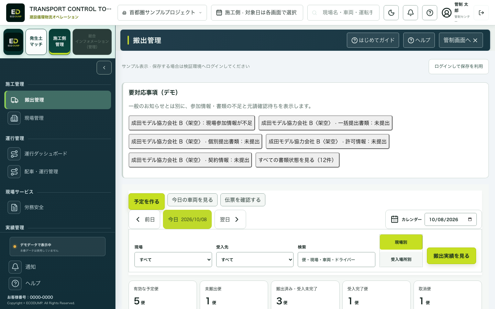
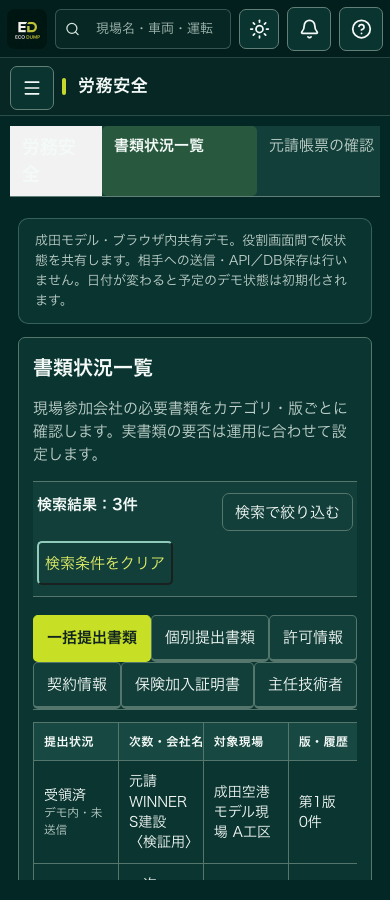
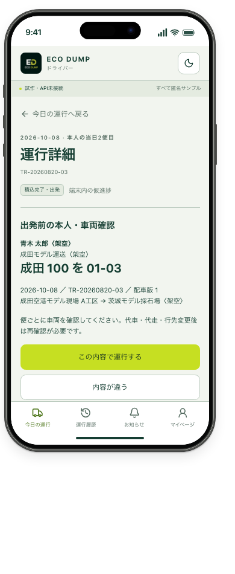
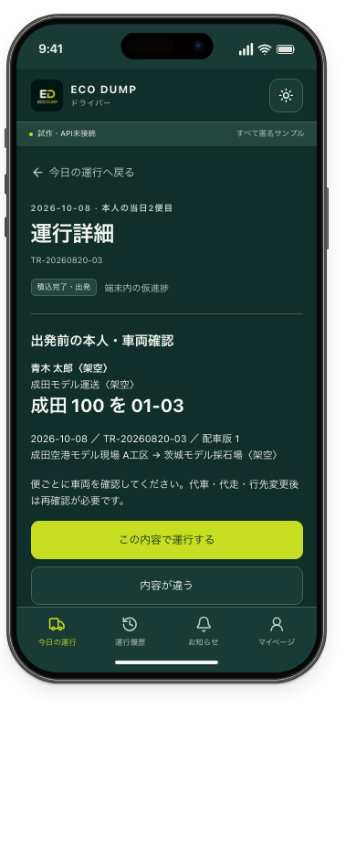
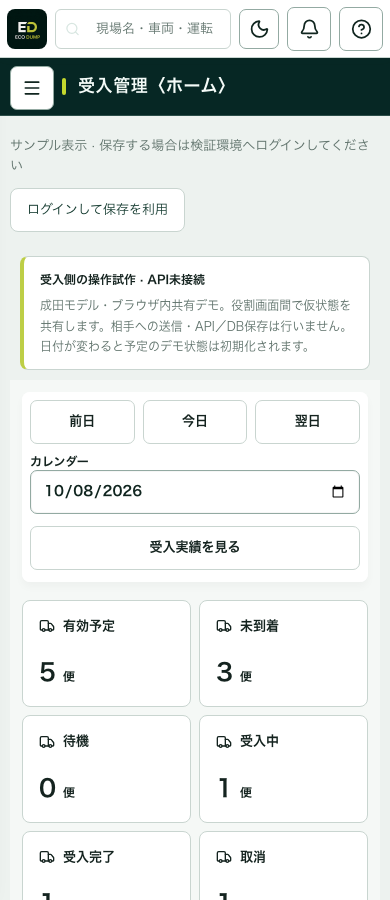
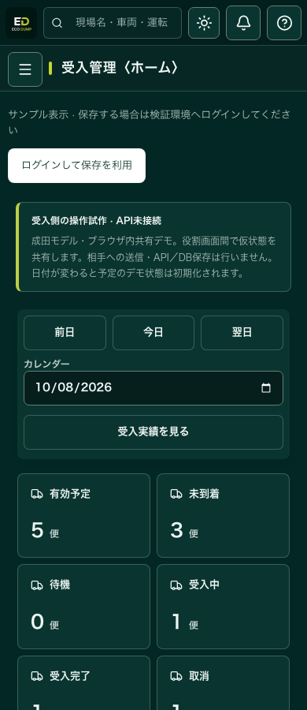

# ECO DUMP 2026-10-08 フロントエンド修正・検証記録

承認された再確認一覧に沿って、既存シェル・サイドバー・会社情報・必要な労務安全を維持して修正した。資料の57項目は「今回の画面修正」「未決定の業務ルール」「後工程・管理事項」を区別する。

## 実装した変更

- **施工側**：運行ダッシュボードの対象日と件数も共通便へ統一。便なしの日に別日の便を代用しない。現場内の搬出予定／実績を共通コンポーネントへ統一。対象日・現場条件を保持。別現場混在と便なし現場の代用を除去。実車両／便数／車両当日便順／本人当日便順を分離。総計画・累計確定・残計画・超過・未確定報告を単位別に表示。
- **共通予定・割当**：既存成田マスターIDを再利用し、3役割のプレビュー便を共通化。理由必須の配車変更・取消、変更前後・適用日時・配車版を保持。受入再確認とドライバー再確認を追加。前日／任意日コピーは予定だけをコピーし、確認必須・同一対象日の二重コピーを防止。
- **車両**：車番・所属会社・積載量・車検期限・添付を管理。期限切れ検索を動作させ、不要な利用状況を整理。台帳編集は過去便の担当・車番を更新しない。変更前の割当も日付付き履歴から確認できる。
- **労務安全**：残す4メニュー／6カテゴリを保持。カテゴリごとの実項目・会社名／状態検索・不足チェック・仮提出・差戻し・再提出・元請確認・コメント・版履歴を実装。確認済み内容の変更は再提出対象へ戻す。
- **現場参加・要対応**：既存会社選択→現場／業務区分／担当／メール→不足書類→元請確認の導線。トップの不備と一般通知を分離し、該当会社・カテゴリ・便を保持して移動。
- **受入側**：共通便の予約・受付・荷下ろし・確定数量を再表示・再読込しても維持。受入不可を取消と区別。日次の便数枠・数量枠・単位・変更履歴を追加。予約残枠はデモ上の算数であり、新規予約を許可する正式容量判断ではない。
- **ドライバー**：本人の便だけを表示。出発前確認を詳細上部へ配置し、車番を大きく表示。便・日・本人・車両・配車版ごとに確認。未確認・受入変更確認待ちは運行報告を停止。初回確認は接続画面にも追加し、既存の配車変更確認・API処理を保持。報告と伝票は別、荷下ろしと数量確定も別。過去日の端末下書きが同じIDの当日便に混ざらないよう営業日を保持。
- **見やすさと既存維持**：対象日・検索を固定、モバイルでは固定領域の高さを制限。会社情報4タブ・詳細だけスクロール・編集下書きを維持。総合インフォメーションは事業者側で無効。実GPS・道路照合・OCR・通知の模擬成功を表示しない。

## データと保存の境界

プレビューは `src/demo/store.jsx` の同じブラウザ／同じ公開オリジン内のlocalStorageで共有する。別端末へ送信されない。予定デモは日付変更時に初期化する。伝票写真・報告下書きは日付・本人・便を区別した端末内データ。会社情報／受入場所の既存編集は画面内の試作で、離脱時にリセットする。既存のAPI／DB接続経路は別に保持し、SQLマイグレーション・DBシード・本番権限は変更していない。

成田マスターのUUIDは `src/demo/naritaIds.mjs` に抽出し `server/setup.mjs` から再exportする。値は変更なし。プレビューのTR便IDは互換性のため保持しており、ID内の日付文字列から営業日を推測しない。表示日と検索日は各便の `date` を使用する。会社書類のNC番号・受入場所Y番号は表示・試作管理用の別名で、共通マスターUUIDと区別する。

## 必須項目の画面上の扱い

|対象|必要な情報|扱い|
|---|---|---|
|会社・現場参加|既存会社、参加現場、業務区分、担当者、招待先メール|選択＋必須入力。不足をチェックリスト表示。招待未送信|
|本人・運行|本人ID、所属運送会社、便ID、車両ID／車番、搬出元、受入先、指定時刻、配車版|本人便に限定し、初回／変更後確認|
|車両|車番、名称、会社、種別、最大積載、車検期限|必須手入力。添付JPEG／PNG／PDFは2MB以下。OCRなし|
|数量|予定数量・単位、報告数量・単位、受入確定数量・単位、差異理由|段階別保存。単位の自動換算なし|
|変更|便ID、変更前後、適用日・便、理由、配車版|理由必須、古い版の配車変更を拒否|
|日次枠|日付、受入場所、便数枠、数量枠、単位|未設定を許容。物理／契約／月間容量と別|

## 検証

- 関連モデル・帳票・ドライバー・受入・Sites単体試験：最終コードで43件すべて成功。
- 既存画面＋今回の画面・業務操作試験：最終コードで130件すべて成功。受入モバイル8件、運行ダッシュボードの対象日継承・空結果も含む。
- PC1440、モバイル390、タブレット1024／768を検証。ライト／ダーク、空結果、カテゴリ検索、会社情報固定・下書き、配車コピー、数量差異、受付・確定・再読込、XLSX出力を確認。
- 同じブラウザの3タブで、同一便の配車変更、本人確認→到着→荷下ろし→伝票6.9m³→受入確定6.8m³→施工側実績を確認。予定7m³を保持し、伝票番号も共有。
- `npm run build`、`git diff --check` 成功。実機GPS・カメラ・HEIC・別端末API3者試験は今回のフロントエンド検証に含まない。

## 57項目の対応

「画面修正」は今回のフロントエンド対象の完了。「画面＋定義待ち」は画面を実装・維持し、未合意事項を追加しない。「後工程／管理事項」は今回の画面修正と分ける。

|No.|項目|今回の対応|
|---|---|---|
|01|施工→運行→受入の設計順|共通成田データを施工→運行→受入の順で統一。|
|02|成田の最小構成|成田A/B工区・栃木/茨城・架空ドライバーの共通便を展開。|
|03|会社・ユーザー・車両・人物の項目|既存台帳を保持。参加フォームに所属会社・役割・現場・担当者・メールを明示。必須項目は下表。|
|04|3画面共通台帳・DB|同一会社・現場・便・車両・人物の参照へ統一。既存API/DBを保持。|
|05|現場・元請・一次・二次・車両・人物|元請／一次／二次のデモ階層を表示。正式な参加・承認権限は業務決定対象。|
|06|既存台帳の再利用|既存会社選択→現場参加情報へ。|
|07|上部・左導線重複|現場内の旧予定・旧実績と固定配車表を統一。承認済みの機能・会社・労務タブを維持。|
|08|検索・絞り込み固定|搬出・配車・実績・受入の日付・検索の固定表示。|
|09|施工管理への集約|現場から予定・配車・運行・実績へ同じ条件で遷移。|
|10|現場から運行・実績|対象日と現場を保持する共通コンポーネント。|
|11|搬出入へ文言変更・会議整理|搬出入記録へ改称。車両時刻・写真・伝票の入口を保持。|
|12|教育削減・人物範囲|教育関連は戻さず、4メニュー・6カテゴリ・会社／状態検索を保持・修正。|
|13|車両の不要項目|台帳から利用状況を整理。車検期限切れ検索を動作。|
|14|全体／現場別|全体／選択現場と対象日の保持を統一。|
|15|役割別ダッシュボード|役割ダッシュボード・件数を共通便から生成。|
|16|会社／現場／受入先別|現場・受入先の共通条件を適用。既存APIの担当範囲制御を保持。他社の公開範囲は今回拡張しない。|
|17|明細と地図|既存タイムライン・地図切替を保持し、共通便へ統一。地図はサンプル／実GPS未接続。|
|18|メニューと修正範囲|不要教育・会議等を再追加せず、必要労務安全とドライバー検索を維持。|
|19|実績の期間・各条件|現場内とメインの実績期間・条件を共通化。|
|20|全受入先／個別|全受入先／個別受入先の条件を共有。|
|21|現場の重複表示省略|選択現場の実績に他現場を含めず、現場列の繰り返しを省略。|
|22|現場量・累計・進捗|検証用計画量・累計確定・残計画・進捗・超過・未確定報告を単位別表示。|
|23|必要車両と予定増減|日次の予定追加・未手配・車両割当と変更版・3画面照合。|
|24|計画と実績分離|予定・報告・受入確定を同一便から別表示／集計。|
|25|最終の搬出元・搬入先|変更前後の行先と割当を保持。実績確定時の到着先を別保持。実GPS照合は後工程。|
|26|手配の用語|実車両台数と予定便数を区別。|
|27|台数／便数／回転|車両の当日便順と本人の当日便順を別算出・表示。未配車を台数に数えない。|
|28|同日複数現場履歴|同日複数便・車両変更・現場変更を便IDと前後履歴で保持。|
|29|自社運行と受入混雑|自社明細と枠のデモ集計を区別。全社の混雑・他社閲覧範囲は定義待ち。|
|30|車番・最大積載・車検|車番・最大積載・車検期限・添付を実装。|
|31|車検証読取・手入力|車検証添付と手入力を実装。OCR・HEIC変換は後工程。|
|32|日付付き人物・車両履歴|当時の車番／担当・変更前の割当・日付範囲を台帳履歴から表示。|
|33|本人・当日車番の確認|初回と便ごとの本人・車両・配車版確認。|
|34|給与連携への不整合防止|当時の車番・担当者と変更前後を保存。給与連携は初期対象外。|
|35|招待→登録→提出→元請|招待下書き→参加情報→不足書類→元請確認。実メール未送信。|
|36|元請の提出情報確認|カテゴリ・会社・版別の仮提出／差戻し／確認と履歴。|
|37|提出前の不足表示|参加必須情報・カテゴリ別不足表示。|
|38|重要事項のトップ表示|トップに参加不足・未提出・差戻し・元請確認待ちを表示。|
|39|通知から該当画面|通知と要対応から対象便／会社／カテゴリへ移動。|
|40|ベル／重要事項の区別|トップの要対応事項とベルの確認入口を分離。正式な通知配信ルールは未決定。|
|41|日ごとの受入容量|日次便枠・数量枠・単位・変更履歴を別設定。|
|42|空き・超過・待機・予測|予約便数・実車両・日次便枠の残り／超過を表示。予約数量も単位別。正式容量・予測・消化ルールは未決定。|
|43|色・率の閾値|率や閾値は未設定。数値と状態名で表示。|
|44|翌日の締切と閲覧|日付切替と翌日を維持。締切の時刻・禁止ルールを追加しない。|
|45|禁止か変更履歴か|変更理由・版・履歴・受入再確認を実装。完全禁止や取消権限の正式ルールは未決定。|
|46|過大予約・占有対策|予定コピーの二重追加を防止。実運用の枠占有・解放ルールは未決定。|
|47|信用度・許容差・取消料|数量差異と理由履歴を保持。信用点・許容誤差・料金は設定しない。|
|48|中間保管|中間置場の入出庫・在庫は後工程。今回追加しない。|
|49|CO₂比較元|未計測のCO₂削減値は表示しない。計測・算定は後工程。|
|50|走行・待機・燃料計測|待機開始・呼出し・荷下ろし開始の端末記録を追加。走行GPS・燃料連携は後工程。|
|51|成田ダミーと複数パターン|既存成田マスターUUIDを共有。便ID互換を保持し、別の営業日項目で検索。|
|52|追跡・表示・遷移試験|同一便3役割、正常／変更／取消／受入不可／差異／再表示の試験を追加。|
|53|既存サービスとの差|既存の画面構成を保持。競合比較・法的判断は今回のソフトウェア修正対象外。|
|54|専門家相談|専門家相談は未実施。法的結論を出さない。|
|55|期限|目安日を確定期限に置き換えない。責任者と期限は業務決定対象。|
|56|担当と体制|担当者の指名は未実施。実装・試験・外部連携の体制は業務決定対象。|
|57|次回会議|会議の招待・カレンダー登録は行わない。|

## 画面証拠

