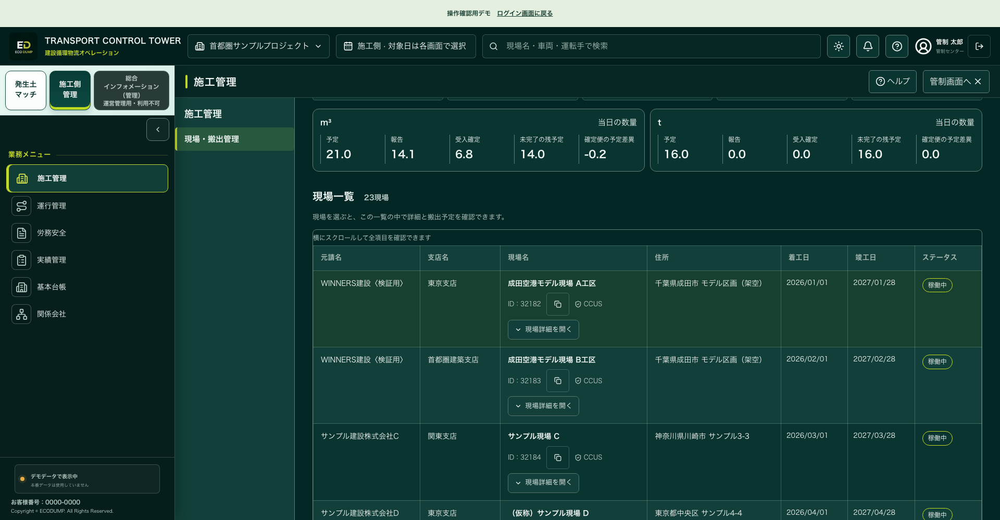
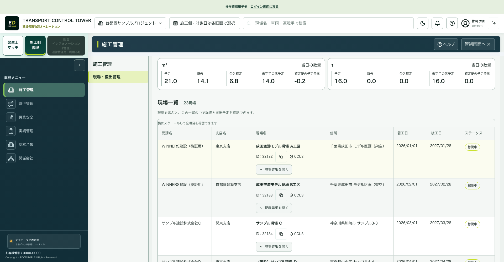
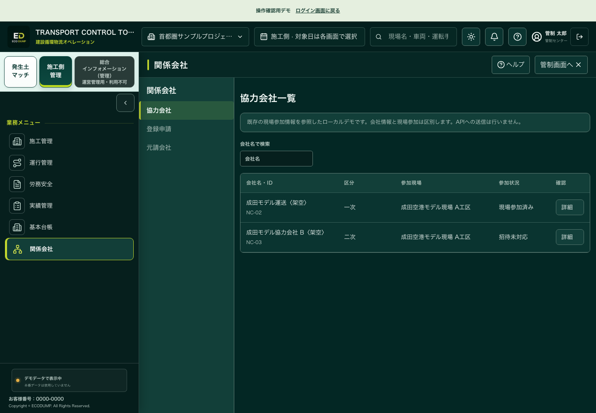
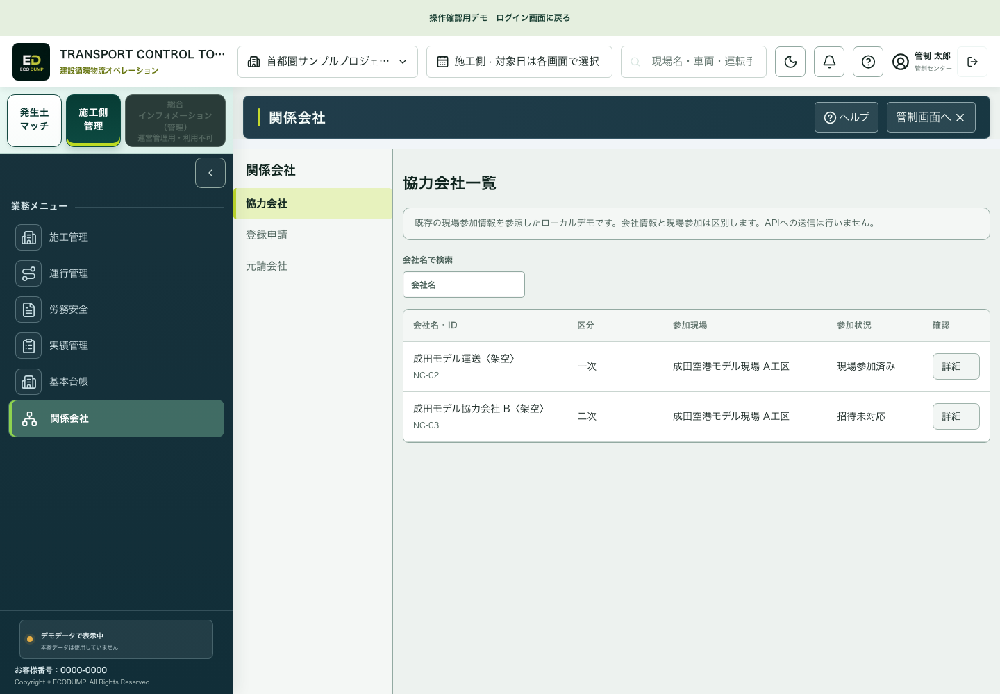

# ECO DUMP 修正とE2E確認結果

2026-10-09。承認された「元画面を保持した修正提案」の43項目を順番に対応し、既存機能の維持も照合しました。今回の完了範囲は、承認された画面の表示・操作改善です。ユーザーの指示によりorigin/mainへの公開を再検証しました。

元のロゴ、ヘッダー、ミント色の切替帯、緑・白・ライムの配色、書体、二段メニュー、現場表、地図、マッチングの左右配置と縦棒グラフを保持しています。重複入口の整理、文字の折返し、ボタン幅、余白、対象を保った移動を改善しました。

[操作できる施工画面](http://127.0.0.1:4177/?preview=app&role=construction&page=transport&demo=1&navigationReview=1&review=20261009-readability) / [運行画面](http://127.0.0.1:4177/?preview=app&role=construction&page=control&demo=1&navigationReview=1&review=20261009-readability) / [受入画面](http://127.0.0.1:4177/?preview=app&role=receiving&page=transport&demo=1) / [ドライバー画面](http://127.0.0.1:4177/?app=driver&demo=1)

## プッシュ前の再検証

最終修正版：全体E2E195成功（失敗・スキップ・不安定成功0、53.9秒）、業務・数量・文脈の単体検証39成功、Sites4成功、公開用ビルド成功。両テーマ・5画面幅の352表示で画面エラー・ページ外への横はみ出し・操作文字の切れ0。単色背景の可視文字2,548件の明暗差検査で基準未満0。画像・透明・グラデーション・WCAG全体は数値検査の対象外です。

隔離したリリース作業ツリーのapp配下307ファイルはローカル確認版とSHA-256で一致しました。`VITE_BASE_PATH=/ECodump-New/ npm run build`で実公開と同じパスのビルドを作り、`node scripts/check-pages-navigation.mjs`で27状態を確認しました。各業務、会社詳細→不足書類→労務安全→会社詳細への戻り、通常の施工／受入／ドライバー画面、review.htmlの入口が成功しました。公開検証中のAPIアクセスと欠損静的ファイルは0です。

追加で見つけた受入管制の表示不一致も修正しました。受入場所・状態で絞り込んだ際の見出しと選択行は、地図と同じ便IDを示します。0件の場合は「対象便なし」とし、詳細操作を無効にします。不一致を再現する回帰テストが修正前に失敗し、修正後に成功した後、全体195件を再実行しました。

最初の公開検証はローカル用のルートパスでビルドしたため読み込みが失敗しました。公開用パスを明示して再ビルドし、最終確認はすべて成功しています。検査条件の相違による失敗で、アプリのデザインを変更する対応は行っていません。

可視範囲の確認対象は1440 / 1280 / 1024 / 768 / 390 CSS px、現場・会社表は1920pxも含みます。200%相当と長い会社名は76表示の確認も実施しました。これは720 CSS px・deviceScaleFactor 2による拡大相当の検査で、物理端末やブラウザーの文字だけ拡大の実測ではありません。

再現可能なE2Eは`app/tests/ui/readability-review.spec.mjs`、`field-table-review.spec.mjs`、既存の全体・業務テストに含めています。集計と候補ファイルの指紋は[checks.json](checks.json)に記録しています。全画像・実行ログはローカルの`tmp/readability-push-verification-2026-10-09/`に保存しました。

プッシュ対象は承認されたapp修正とこの確認資料です。既存の別用途の画像差分、複製ファイル、本番API・DB・認証設定は変更していません。GitHub上のコミットと実際の公開完了は、この検査結果とは別に確認します。

## 43項目の照合

「確認済」は、追加修正と、承認済みの挙動の維持を含みます。43個の新しい不具合があったという意味ではありません。

| ID | 修正・保持した内容 | 確認した操作・表示 | 結果 |
|---|---|---|---|
| G01 | 上部ロゴを保持し、左の重複ロゴタイルを整理 | 役割別ホーム、マッチングと管理への切替 | 確認済 |
| G02 | 切替ボタンの順序・角丸・選択線を保持し、改行と高さを整理 | 3入口、選択状態、総合インフォメーションの利用不可理由 | 確認済 |
| G03 | 二段メニューと本文を保持し、本文内で必要な表・グラフのスクロールを確保 | PC、タブレットの選択欄、スマートフォンのメニュー、最終行 | 確認済 |
| G04 | 関連文字を揃え、長い名称を自然に折返し、操作幅を確保 | 長い会社名、ドライバー情報ボタン、5画面幅・拡大相当 | 確認済 |
| G05 | 主操作・選択線・補助枠・状態文言を整理 | 選択中の状態、解除、取消・遅延などの文字表示 | 確認済 |
| G06 | 共通デモ説明を短い表示と詳細開閉に統一 | 閉じても未送信が分かる、開くと元の説明を読める | 確認済 |
| G07 | プロジェクトは名称の表示例と明示 | 名称切替が現場所属の絞り込みを偽装しない | 確認済 |
| G08 | 現場・車両・ドライバーを実際の参照IDで全体検索 | 32184、佐藤、01-02で該当詳細へ移動、手動選択で対象更新 | 確認済 |
| G09 | 共通ヘルプとページの操作説明を分け、左下の重複入口を整理 | 共通ヘルプと労務安全ヘルプの本文が異なる、通知の移動 | 確認済 |
| W01 | 要対応事項を会社・現場単位でまとめ、重要対象と全件確認を表示 | 不足6件、確認待ち6件、対象会社と関連書類 | 確認済 |
| W02 | 23現場・元請／支店／現場／住所／着工／竣工／状態の7列を維持 | 最初と最後、列の揃い、住所折返し、横スクロール | 確認済 |
| W03 | 一覧内の9詳細を選んだ内容だけに整理 | 概要・条件・予定・車両・運行・記録・数量・書類・協力会社 | 確認済 |
| W04 | 現場・搬出管理の統合を維持し、対象と戻りを保持 | 日付／現場／便、実績との往復、空の現場に便を混ぜない | 確認済 |
| O01 | 配車作成・コピー・担当変更・取消・履歴を維持 | 変更理由、版、競合、取消、変更後の再確認 | 確認済 |
| O02 | 元の地図・タイムラインを保持し、便情報と凡例を地図外へ整理 | 選択便の詳細、地図拡張、業務メニュー保持 | 確認済 |
| O03 | 段階ズームと全体／選択便表示を維持 | ボタンの半段階ズーム、急なホイール・ダブルクリック拡大を抑制 | 確認済 |
| O04 | 状態ごとの意味と対象件数を整理し、条件を保持 | 有効予定・未手配・配車済み・遅延などの絞り込みと戻り | 確認済 |
| O05 | 時刻順と便IDを読める表示に整理 | 全便の並び、選択ID、時刻・状態・経路が対応 | 確認済 |
| M01 | 候補左・詳細右の原形を維持 | 選択対象、詳細上部の操作、狭い幅で候補へ戻る | 確認済 |
| M02 | 元の円・縦棒グラフを維持し、意味のない線と重複表示を整理 | 4分類の棒、値・単位・分類が対応 | 確認済 |
| M03 | 容量・日別グラフの期間窓と内訳を接続 | 月／期間、7日窓、10日の内訳、グラフ内スクロール | 確認済 |
| M04 | 日次枠・期間枠・物理容量と単位を区別 | m³とtを換算・混合せず、サンプルの算定範囲を表示 | 確認済 |
| M05 | 必要書類を選択候補の確認欄で開く | 候補ID MT-2026-001、5書類、実ファイル未接続、Escで戻る | 確認済 |
| M06 | 探索・距離・土質・期間を実際の候補絞り込みへ接続 | 20kmで1件、1kmで0件、解除、入力不備、登録下書き・未保存確認 | 確認済 |
| M07 | 件数と集計の対象範囲を明記 | 検索結果件数とサンプル全体件数を区別 | 確認済 |
| L01 | 会社・現場ごとにまとめ、不足・確認待ちの状態選択を追加 | 不足はNC-03、確認待ちはNC-02、再読込後の条件 | 確認済 |
| L02 | 6カテゴリ・18書類の実内容・ID・版・履歴を維持 | 許可情報等で異なる書類、提出と確認が別状態 | 確認済 |
| L03 | 元請帳票と配下協力会社検索を維持 | 対象会社・現場の検索、詳細と一覧への戻り | 確認済 |
| B01 | 会社表と4区分を保持し、編集を通常幅で右寄せ | 本社／CCUS／労務安全／支店、下書きが別業務・再読込でも残る | 確認済 |
| B02 | 元のユーザー・車両項目を保持し、検索と詳細を整理 | 対象ID、長い値、タブレットで入口の検索が画面内に表示 | 確認済 |
| B03 | レビューの主入口は基本台帳のドライバー検索に統一 | 労務安全の重複主入口なし、車両に対応する担当者 | 確認済 |
| B04 | 会社詳細で情報／現場参加／不足書類を確認 | 会社・現場・書類ID、労務安全から同じ会社詳細へ戻る | 確認済 |
| B05 | 登録確認・参加・書類の各状態を分けて維持 | 登録内容のデモ確認だけで参加承認・受領にならない | 確認済 |
| T01 | 数量表示を1桁小数に整理し、原値とExcel数値セルを維持 | 14.1表示、未報告と0、m³／t別集計、画面とExcelの対象一致 | 確認済 |
| T02 | 選択便の記録・写真・伝票の区分を維持 | 種類・時刻・確認状態、原本と表示例、別便を混ぜない | 確認済 |
| R01 | 受入の元の管制画面にも地図・凡例・便情報の整理を適用 | 場所別の配車済み4→2便、同じ選択便、地図欄の最後まで操作可能 | 確認済 |
| R02 | 受入ホーム・予約の元の配置を保ち、余白と日付操作を整理 | 場所・日付・便・状態、前日／翌日、タブレットの過大な空白を解消 | 確認済 |
| R03 | 受入場所・設定・代理店の元の区分と操作を維持 | 2受入場所、枠条件、設定の未保存・未接続表示、代理店の区別 | 確認済 |
| D01 | iPhone枠・4画面・本人／車両確認を保持 | 配車変更後の再確認、荷下ろし報告と受入確定を区別 | 確認済 |
| D02 | 採用済み写真・ロゴ・フォーム配置を保持 | ログインと登録、入力ラベル・エラー・デモ未送信表示 | 確認済 |
| X01 | フォーカス・Esc・戻り・キーボード操作を確認 | モーダルのTab循環、閉じた後の復元、地図欄のEnd操作 | 確認済 |
| X02 | 0件・不備・未接続・失敗を明示し、入力を保持 | 保存領域が使えない場合も値を消さず、保存成功を偽装しない | 確認済 |
| X03 | 原配色の両テーマ・5画面幅・拡大相当を再確認 | 352表示＋76拡大表示、長い会社名、明暗差、全メニュー・補足詳細 | 確認済 |

## 画面と業務の確認範囲

施工側は現場・搬出管理、配車・運行管理、運行ダッシュボード、マッチング、労務安全、会社情報、ユーザー、車両、ドライバー検索、協力会社、登録申請、元請会社、実績です。会社4区分、現場9詳細、書類6カテゴリ、各詳細・戻りも確認しました。

受入側はホーム、受入場所、予約・受付、管制、実績、設定、マッチング、会社情報、ユーザー、車両、代理店、代理登録、自社の代理元です。ドライバー4画面、運行詳細、問題報告、ログイン・登録も対象です。

同じ便を施工→受入→ドライバーで追う確認では、担当変更後の本人・車両の再確認、報告と受入確定の区別、数量と伝票確認を検証しました。別の会社・現場・便へ意図せず切り替わる箇所は修正しています。

## 完了範囲と外部接続

今回合意した表示・操作改善について、最終確認で未解決の画面不具合は検出されていません。デモの変更はブラウザー内であり、実GPS、実ファイル、相手への送信、本番APIへの保存を確認したという意味ではありません。実機の指操作・長時間利用も別の確認範囲です。これらの境界を画面に残しています。

ユーザーが2026-10-09に承認したリリースの候補確認です。既存の作業差分を保護し、未送信デモと実API経路を区別したまま公開します。

## 元の画面構成を保った表示記録

